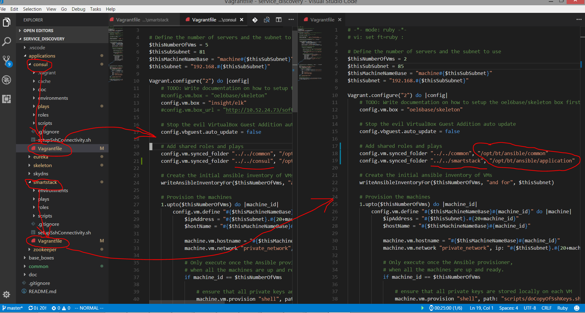

# 7. Use common mount name for each unique application

Date: 2018-03-01

## Status

Accepted

## Context

Given that:

* the skeleton can contain 1 or many unique infrastructure applications.  For example, a recent proof of concept for many service discovery toolsets contain 5 separate applications: consul, eureka, smartstack, etc. For example:

* it is important to make re-use of roles easy.  For example, I might write a test in the consul application that also want to re-use in the smartstack one.  

Therefore, the following decision was made

## Decision

All applications, whether consul, or smartstack, or eureka will mount to a common /opt/skeleton/ansible/application mount point

## Consequences

Re-use will be easier because code will reference /opt/skeleton/ansible/application rather than /opt/skeleton/ansible/consul or /opt/skeleton/ansible/smartstack.  This will make it easier to port and re-use code between the applications.
