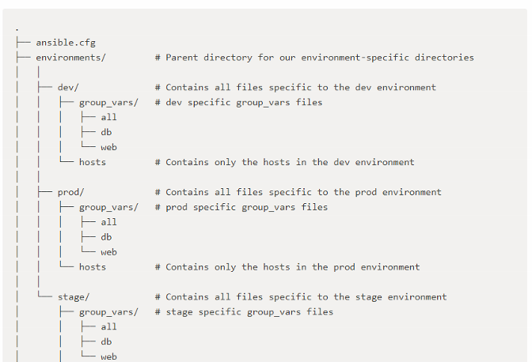

# 10. Create separate dev, test, and live environment groups

Date: 2018-04-10

## Status

Accepted

## Context

Ansible scripts should re-used across different environments dev, test and live.  In other words, the data like IP addresses, usernames, memory allocations, etc that are specific to these environments should be extracted out so that the ansible playbooks can run exactly the same in in all environments.  Additionally, the infrastructure tests should also pass for any environment.  Hardcoded values in the tests will be brittle and only work in a particular environment.

## Decision

Therefore, split the environment configuration, which includes inventory definitions, variables, into groups.  The basis of this decision can be seen at <https://www.digitalocean.com/community/tutorials/how-to-manage-multistage-environments-with-ansible>. For example:

## Consequences

Consequently, ansible-playbooks can be re-used without difficulty across different environments
